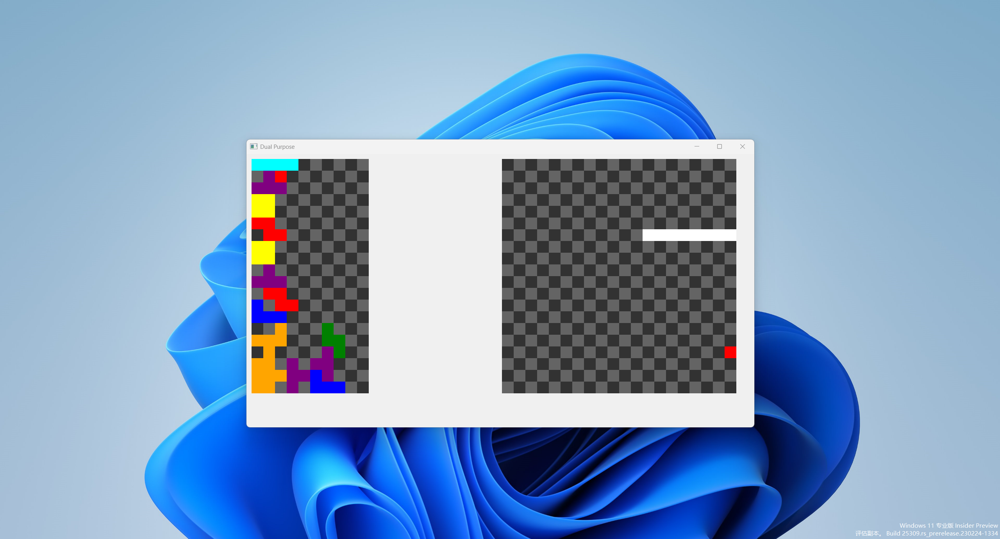

# Dual Purpose

Control the block and the snake at the same time through the keyboard. 
When either side of the game ends, the player is considered to have lost.

# ScreenShot



# Install & Play

```
pip install pyqt5
git clone https://github.com/aoout/DualPurpose.git
cd DualPurpose
python DualPurpose.py
```